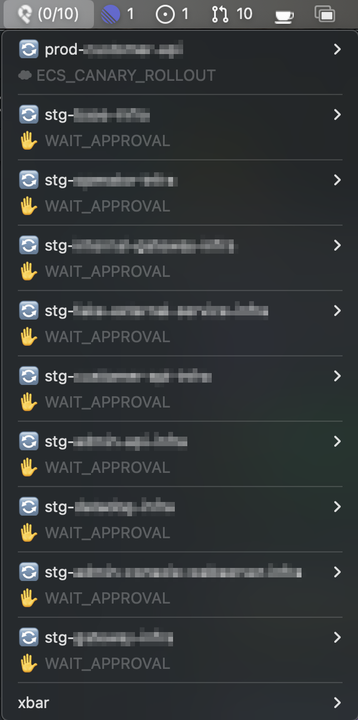
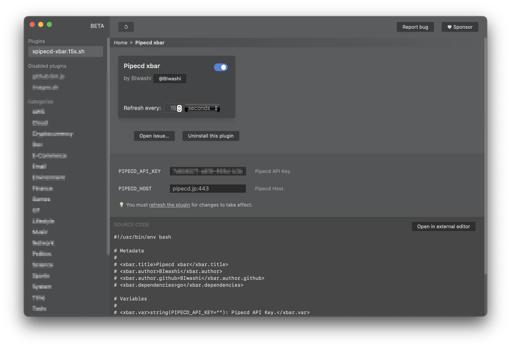

# xpipecd-xbar

Using [xbar](https://github.com/matryer/xbar), an OSS that allows displaying anything on the macOS menu bar, this plugin shows the status of [PipeCD](https://github.com/pipe-cd/pipecd).

[matryer/xbar: Put the output from any script or program into your macOS Menu Bar (the BitBar reboot)](https://github.com/matryer/xbar)



# How to setup

1. Install xbar

```sh
$ brew install xbar
```

2. Install the plugin

```sh
$ git clone git@github.com:BIwashi/xpipecd-xbar.git
$ cd xpipecd-xbar
$ make setup/cli
```

To change the API call interval (default is 30s), do the following:

```sh
$ make setup/cli t=60s
```


3. Setup xbar config

Open xbar Plugin settings (Open Plugin)


Activate by selecting `xpipecd-xbar.{time}.sh`
Set `PIPECD_API_KEY` to your PipeCD API Key (read only)
Set `PIPECD_HOST` to your PipeCD Host




# Mechanism

The xbar plugin is a script that runs at regular intervals, with xbar displaying its standard output on the menu bar.
The execution frequency is expressed in the file name.

```sh
{plugin_name}.{time}.{ext}
```

The plugin can be used by placing it in the following directory.

```sh
$(HOME)/Library/Application\ Support/xbar/plugins/
```

`make setup/cli` performs the following operations:

1. Uses the internal implementation of PipeCD's CLI, pipectl, to make API calls to the PipeCD control plane
2. Builds the above implementation
3. Creates a symbolic link in `$(HOME)/Library/Application\ Support/xbar/plugins/` for the shell script `xpipecd-xbar.sh` and the built executable itself