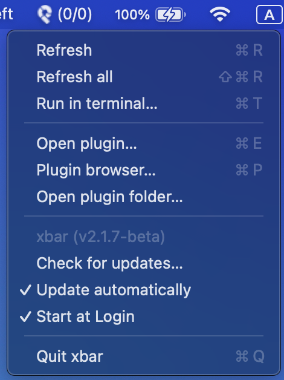

# xpipecd-xbar

[xbar](https://github.com/matryer/xbar) という macOS のメニューバーに好きなものを表示できる OSS を利用して、[PipeCD](https://github.com/pipe-cd/pipecd) のステータスを表示する Plugin.

[matryer/xbar: Put the output from any script or program into your macOS Menu Bar (the BitBar reboot)](https://github.com/matryer/xbar)


# How to setup

1. install xbar

```sh
$ brew install xbar
```

2. install plugin

```sh
$ git clone git@github.com:BIwashi/xpipecd-xbar.git
$ cd xpipecd-xbar
$ make setup/cli
```

もし api への call 間隔を変更したい場合（デフォルトでは30s）は以下のようにする。

```sh
$ make setup/cli t=60s
```


3. setup xbar config

xbar の Plugin 設定（Open Plugin）を開く



xpipecd-xbar.{time}.sh を選択して有効化する
`PIPECD_API_KEY` に PipeCD の API Key（read only）を設定する
`PIPECD_HOST` に PipeCD の Host を設定する


# 仕組み

xbar plugin は、一定間隔で実行されるスクリプトであり、xbar はその標準出力をメニューバーに表示する。
実行頻度はファイル名で表現される。

```sh
{plugin_name}.{time}.{ext}
```

plugin は以下のディレクトリに配置することで使用できるようになる。

```sh
$(HOME)/Library/Application\ Support/xbar/plugins/
```

`make setup/cli` は以下の操作を行なっている.

1. PipeCD の CLI である pipectl の内部実装を使用し、PipeCD のコントロールプレーンに対して API を叩く
2. 上記の実装を build
3. build した実行ファイルを呼び出す shell script `xpipecd-xbar.sh` と実行ファイル自体を `$(HOME)/Library/Application\ Support/xbar/plugins/` に対してシンボリックリンクを貼る

